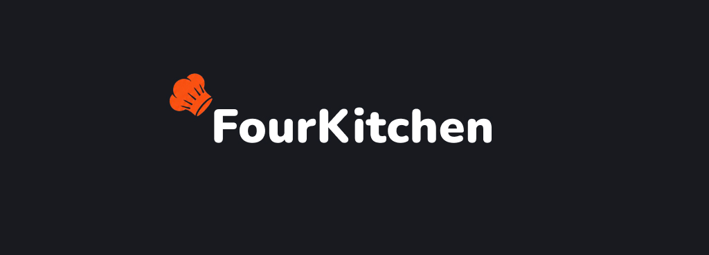

<p align="center">
  
  
  
  
  
</p>

<p align="center">Sistema de gerenciamento para restaurantes desenvolvido com arquitetura de microsserviços.</p>

---

# 📖 Sobre o projeto

O **FourKitchen** é um sistema de gerenciamento para restaurantes desenvolvido para fins de estudo durante o **FourCamp**.

O objetivo do projeto é simular um ambiente real de desenvolvimento utilizando uma arquitetura baseada em **microsserviços**, proporcionando experiência com comunicação entre serviços, autenticação, integração frontend/backend e aplicação de boas práticas de desenvolvimento.

O sistema contempla todos os principais fluxos de um restaurante, desde o autoatendimento até o gerenciamento operacional.

---

# ✨ Funcionalidades

## 🖥️ Autoatendimento (Totem)

* Realização de pedidos
* Consulta do cardápio
* Fluxo de pagamento

---

## 📱 Mesa

A mesa possui um tablet onde o cliente pode:

* Realizar pedidos
* Acompanhar o status dos pedidos
* Solicitar atendimento do garçom

---

## 👨‍🍳 Garçom

O garçom possui acesso a um painel onde pode:

* Visualizar suas mesas
* Criar pedidos
* Acompanhar pedidos
* Receber chamados das mesas
* Receber notificações da cozinha
* Fechar contas
* Dividir contas
* Visualizar pedidos prontos para retirada

---

## 🍳 Cozinha

A cozinha recebe automaticamente todos os pedidos realizados.

Ela pode:

* Iniciar preparo
* Marcar pedido como pronto
* Informar indisponibilidade de itens
* Sinalizar problemas no pedido

Quando um problema é identificado, o garçom é notificado imediatamente para que possa solucionar a situação junto ao cliente.

---

## 👨‍💼 Gestor

O gestor possui funcionalidades administrativas, como:

* Cadastro de garçons
* Cadastro de produtos
* Cadastro de categorias
* Gerenciamento das mesas
* Atribuição de garçons às mesas
* Dashboard com indicadores de desempenho

---

# 🔔 Fluxo de resolução de problemas

Quando a cozinha identifica algum problema (erro no pedido ou indisponibilidade de um produto):

1. A cozinha sinaliza o problema.
2. O garçom recebe uma notificação.
3. O garçom consulta o cliente.
4. O cliente pode:

   * Remover o item;
   * Substituir por outro;
   * Cancelar o pedido.

---

# 🏗️ Arquitetura

O projeto utiliza arquitetura baseada em **Backend for Frontend (BFF)** e **Microsserviços**.

Atualmente o sistema é composto por:

```text
Frontend (Angular)

          │

          ▼

BFF Restaurante

├── ms-cozinha
├── ms-mesas
├── ms-notificacoes
├── ms-pagamentos
├── ms-pedidos
├── ms-produtos
└── ms-usuarios
```

### Microsserviço de Pagamentos

O serviço de pagamentos é atualmente um **mock** utilizado para fins de estudo.

Seu funcionamento consiste em gerar um número aleatório entre **1 e 10**:

* Número par → Pagamento aprovado ✅
* Número ímpar → Pagamento recusado ❌

---

# 🚀 Tecnologias

## Backend

* Java 21
* Spring Boot
* Spring Security
* JWT
* OpenFeign
* Flyway
* Maven
* JUnit
* Mockito

## Frontend

* Angular 21
* TypeScript
* HTML
* SCSS

## Banco de dados

* PostgreSQL
* Supabase

## Documentação

* Swagger / OpenAPI

---

# 📂 Estrutura do projeto

```text
FourKitchen
│
├── 📁 backend
│   ├── 📁 bff-restaurante        # Backend for Frontend
│   ├── 📁 db-migrations          # Scripts de migração do banco
│   ├── 📁 ms-cozinha             # Gerenciamento da cozinha
│   ├── 📁 ms-mesas               # Funcionalidades das mesas
│   ├── 📁 ms-notificacoes        # Notificações do sistema
│   ├── 📁 ms-pagamentos          # Serviço de pagamentos (mock)
│   ├── 📁 ms-pedidos             # Gerenciamento de pedidos
│   ├── 📁 ms-produtos            # Cadastro de produtos e categorias
│   └── 📁 ms-usuarios            # Autenticação e usuários
│
├── 📁 frontend                   # Aplicação Angular
│
├── 📁 docs                       # Documentação do projeto
│
├── 📄 README.md
└── 📄 start-all.ps1              # Script para iniciar os serviços
```
---

# ▶️ Como executar o projeto

## Pré-requisitos

Antes de iniciar o projeto, certifique-se de possuir instalado:

- Java 21
- Node.js
- Angular CLI
- PostgreSQL
- PowerShell (Windows)

---

## Inicialização rápida

O projeto possui um script (`start-all.ps1`) responsável por automatizar a inicialização de toda a aplicação.

Com ele, não é necessário iniciar cada microsserviço manualmente.

---

### Executar toda a aplicação

Inicia:

- Banco de migrações
- Todos os microsserviços
- BFF
- Frontend

```powershell
.\start-all.ps1
```

---

### Executar sem as migrations

Inicia apenas os microsserviços, BFF e frontend.

```powershell
.\start-all.ps1 -SkipMigrations
```

---

### Executar sem o frontend

Inicia apenas o backend executando também as migrations.

```powershell
.\start-all.ps1 -NoFrontend
```

---

### Executar apenas o backend

Inicia apenas os microsserviços e o BFF, sem migrations e sem frontend.

```powershell
.\start-all.ps1 -SkipMigrations -NoFrontend
```

---

## Estrutura iniciada pelo script

```text
start-all.ps1
│
├── db-migrations
├── bff-restaurante
├── ms-usuarios
├── ms-produtos
├── ms-pedidos
├── ms-cozinha
├── ms-mesas
├── ms-notificacoes
├── ms-pagamentos
└── frontend
```

---

# 👥 Equipe

| Nome               | GitHub                |
| ------------       | --------              |
| Amanda Bomfim      | @amandabomfimoliveira |
| Thais Oliveira     | @arievilo-siaht       |
| Lucas Abreu        | @LucasAbreu-94        |
| Raphael Papa       | @RaphaelRPapa         |
| Ivan Goulart       | @Ivan-Goulart         |
| Carlos Bispo       | @carlosbispo2005      |
| Lucas Milanez      | @Lucas-Milanez        |
| Matheus Okada      | @matheusokada-dev     |

---
